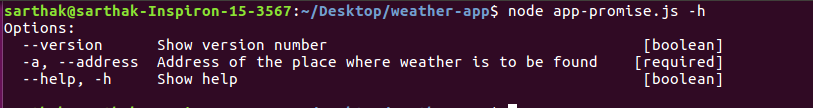
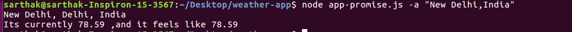

# weather-app
This is node application that helps you to find the weather of the location you pass in as an arugument to the terminal.

It uses google maps api and weather api [darksky](darksky.net) to tell the weather of the specified location.

This node app uses promises rather than using callbacks ,to chain the responses from the different API's

To run the app, you need to first install node and npm.

To install node, Find the instructions [here](https://nodejs.org/en/download/package-manager/)

npm is installed with node.

Now clone the repository on ur desktop

now move into the repository
`$ cd weather-app`

now run `$ npm install` this will install all the dependencies required for the weather application

now run `$ node app-promise.js -h` for help

run `$ node app-promise.js -a "<address of your location>`

